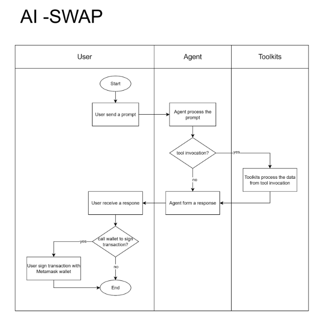

# Vistia

- **Team Name:** Vistia
- **Payment Details:** 
  - **DOT**: 1219fvEtkwUJifAgT7T6tZxsvXrJL9R6VU9BrHzShGY2rXka
  - **Payment**:(USDC) 1219fvEtkwUJifAgT7T6tZxsvXrJL9R6VU9BrHzShGY2rXka
- **[Level]**: 1

## Project Overview :page_facing_up:

### Overview
Our project focuses on bringing AI-powered automated trading into the Polkadot ecosystem, leveraging PolkaVM as the native execution layer for complex machine learning models. By embedding AI trading logic directly on-chain, we aim to ensure that every decision, from market analysis to trade execution, is transparent, verifiable, and free from off-chain dependency.\
The scope of this proposal is to build a proof of concept demonstrating how AI-based strategies can run natively within Polkadot through PolkaVM, while accessing liquidity and interoperability across parachains. This approach reduces latency, lowers operational risk, and showcases how Polkadot can serve as a foundation for AI-integrated DeFi applications.\
Our interest lies in exploring how AI and PolkaVM can combine to create a new class of autonomous financial infrastructure. We believe this work contributes not only to the growth of Polkadot’s DeFi ecosystem, but also to the broader vision of making advanced trading strategies accessible, trustworthy, and inherently verifiable on-chain.

### Project Details

**The initial MVP for AI Assistant UI design will feature the following web-based components:**
- Home page: An introduction to Vistia ecosystem
- AI Assistant chat UI: A messaging interface for users to interact with AI Assistant. Featuring many utilities with integrated text-to-action process.

**The initial MVP for Smart Money UI design will feature the following web-based components:**
- Vault Details: Display the selected vault information.
- My Vaults: Display all your investments.
- Top Holders: Display top 10 holders with the most shares in the selected vault.
- Deposit Transactions: Display all deposit transactions of the selected vault.
- Trade History: Display all transactions made by the trading bot.

**Data Model:**
- AI Assistant: AI Assistant is a chat-based agent that not only helps you gather information but also other tasks like swapping tokens, staking tokens to a pool,.... The conversation between the user and the agent will be saved in a database for personalization. Below is the agent workflow:\

- Smart Money UI: Smart Money UI is an interactive interface that allows users to deposit and track trading vaults activities. Here, the users can take their idle tokens and put them to work through an asset vault smart contract. The vault will be trading for a period of time and after that automatically withdraws all of its assets - capital and profit - back to the holders based on their shares of the vault. Below is the deposit workflow of the vault:\

**API:**
- GET /vault/{vaultId}/shareholders/details: Get saved all shareholders details of the selected vault.
- GET /vault/{vaultId}/deposits: Get saved all deposit transactions of the selected vault.

**Tech stack:**
- ReactJS + Vite
- Typescript
- NextJS
- Python
- FastAPI

Prior Works:
- [Dexonic](https://x.com/SCILabs_io/status/1879076862137335937): An on-chain Technical Analysis app and AI Assistant. 

### Ecosystem Fit

Where and how does your project fit into the ecosystem?\
Vistia fits into the Polkadot ecosystem as an AI-native trading and analytics layer. It integrates Substrate with Polkadot APIs to collect on-chain data from parachains, applies predictive AI models for price forecasting and historical analysis, and deploys smart contracts for staking, fund delegation, and profit sharing. A React/Polkadot.js interface makes these features accessible and user-friendly, lowering the barrier for interacting with Polkadot’s multi-chain environment.

Who is your target audience?\
The primary audience is traders on Polkadot who seek better tools for analyzing markets, predicting price movements, and managing capital more effectively across parachains.

What need(s) does your project meet?\
The project addresses three clear gaps: 
(1) the steep learning curve for new users engaging with Polkadot’s multi-chain design
(2) the absence of AI-native tools that analyze and predict trading opportunities
(3) the lack of AI-driven optimization in DEX aggregators and smart contracts

How did you identify these needs?\
These needs emerged from observing the current ecosystem: despite Polkadot’s strong multi-chain capabilities, users often struggle to access and interpret cross-chain data. At the same time, most existing trading platforms and aggregators within Polkadot do not leverage AI, leaving efficiency and user experience improvements untapped.
These needs are evident from both research and community discussions. Studies highlight Polkadot’s complex multi-chain architecture and lack of standardized data access, which creates barriers for users ([arXiv 2023](https://arxiv.org/abs/2308.00735)
). The Polkadot Growth Strategy Report notes the absence of data dashboards like DeFiLlama or L2beat, limiting visibility into TVL and liquidity across parachains. Community discussions on [Polkadot Forum](https://polkadot.subsquare.io/polkassembly/posts/2148)
 and [Reddit](https://www.reddit.com/r/Polkadot/comments/194ka28/is_there_a_way_to_see_dex_tvl_across_all_polkadot/)
 further stress that traders lack unified tools to track trading volume and opportunities, often facing incomplete or inconsistent data. This evidence confirms the gap Vistia aims to fill with AI-powered trading and analytics.

Are there any other projects similar to yours in the Substrate / Polkadot / Kusama ecosystem?\
Within the Polkadot/Substrate ecosystem, there are projects such as rust-predict (an Ink!-based prediction market), TransparentAI (a hackathon project using AI + zkML to forecast lending protocol rates), and PolkaBotAI (an educational AI chatbot for Polkadot). However, these initiatives are usually limited to a single use case, such as prediction markets, forecasting, or chat assistance. Vistia differentiates itself by combining AI chatbot (SwapChat) for natural language swaps, AI-driven prediction models, and SmartMoney (capital delegation, profit sharing, trading bot) into one integrated system — extending from information delivery to full multichain DeFi execution.

| Feature / Metric                    | Vistia                                 | rust-predict (Prediction Market) | Subsquid (Indexing)         | HydraDX (Omnipool DEX)    | Moonbeam (EVM parachain)   | Phala (TEE compute)              |
|-------------------------------------|----------------------------------------|---------------------------------|-----------------------------|---------------------------|-----------------------------|---------------------------------|
| Core focus                          | AI chatbot + prediction + swap + smartmoney | On-chain prediction markets     | Indexing & API for analytics | Omnipool liquidity DEX    | EVM runtime, dApp compatibility | Confidential compute / TEE       |
| AI integration                      | ✔ agents: chat/prediction/trading      | ✘ (market logic only)           | ✘                           | ✘                         | ✘                           | ✔ (can run secure AI workloads) |
| Chat UX / swap                      | ✔ (SwapChat)                           | ✘                               | ✘                           | ✘                         | ✘                           | ✘                               |
| Prediction models                   | ✔ AI-driven forecasts                  | ✔ prediction market (user bets) | ✘                           | ✘                         | ✘                           | ✔ (if integrated)               |
| Smartmoney (delegation/profit share)| ✔                                      | ✘                               | ✘                           | ✘ (liquidity only)        | ✔ (contracts possible)      | ✔ (compute support)              |

## Team :busts_in_silhouette:

### Team members
- Name of team leader: Luke Nguyen - Experienced in AI & Data, hands-on with infrastructure, logic, and algorithmic design for technical indicators and AI auto trading
- Names of team members:\
**Phung Van Thien** – 9 years in trading,  5 years in Web3. Also, a smart contract developer with hands-on experience building secure, efficient trading platforms across multiple chains\
**Barov Vi** - Over 3 years in Web3 across marketing and BD roles in projects, incubators, and outsourcing driven by a passion for building strong, value-focused communities.\
**Loc La** - Casual trader with a strong technical background, hands-on with multiple front-end and back-end frameworks, and experienced in building and scaling Web3 products \
**Armin Nguyen** - Front-end developer with 2 years in Web3. Passionate about clean UI/UX and precision in execution 

### Contact
- **Contact Name:** Nguyen Duc Loc
- **Contact Email:** locduc1999@gmail.com
- **Website:** www.vistia.co

### Team's experience

We are a team shaped by years of experience across professional trading, blockchain architecture, and real world product development. Several members have spent nearly a decade in financial markets, building and optimizing trading systems. Others have worked across the Web3 landscape, developing everything from smart contracts to scalable backend systems and data layers. Our design philosophy is rooted in precision, transparency, and a commitment to building tools that serve real users.

Our team has consistently demonstrated the technical capacity to deliver and sustain complex blockchain projects:
Hackathon Awards: Recognized in multiple Web3 hackathons, including [Polkadot](https://x.com/openguildwtf/status/1878789352807105021) and [Algorand](https://x.com/VistiaAI/status/1806339133574717915),... for building innovative DeFi and AI-driven solutions.
Incubation Programs: Successfully participated in [Algorand](https://explorer.perawallet.app/asset/2351786320/) and [Pocket Network](https://mail-attachment.googleusercontent.com/attachment/u/0/?ui=2&ik=4014434fec&attid=0.1&permmsgid=msg-f:1838865922536691355&th=1984f6d0565ed69b&view=att&disp=inline&realattid=f_mdmnaaqa0&zw&saddbat=ANGjdJ-Kffav4jptYXAYzFXR-q8G2mBXJbokvAzYIKUbx7a3pBBbkqhzSySqNnukxOiSeplNL4U02bjfoXvw1dwHtBgePL71ljA8BolGuOY8jPTJ7gHOMZ-gA2Pqgo0ZPBwIuKtB61eMb-zqu4lJRpYSewI2D7DRRyoaMEuIyr_rBcKWzGFzYpnMVo3WT76PhGujpAgdrVFT2NhbkyGM4uIbUjuMX4qR1Q4fyqypAaq9-SDRL7EsRCCoHKGVtPJLZ0or-7d0KrGwOmHpcwsSjVvJpc8NFeFzrPrwRqyObUnMUylyMav4Zxb_2cttjZZpuQ-vU4LxSlwj4OyqWokvZjwR4rJI9_ooteUUzokpAOJo9pwyZs6ju9aPF-oWqzswC-_zcgLoIxFrspwpVwsDbfuCfB1qdc3Ifeg4_QgLM8C5NLWHcOy4vjiIULB7zIUcLVjyrJgp6sT-DF27tpGuvM30udcj9tIP-zoxZVDo7WjCZ0WUApC26zKrRFVDD2g7mzvhdRTAy5AHNmDnD6ulPRZw-VHC4EQCr0oYPvrCgDyWeyvb-e7QVz0vtoRRP-MPnFOaExiKnMUkaj4dZwo8qAbs8Z6sADsUn3vI2scvd_yJxNO6i8vRhq3rxAbeNPv4mDSV4OM-rjNS_gvt_i8Vbd-qm6DR5zFCRQ2-u8sYfEO9PQJ7QpOzCpHPORUyp5e-weVw6l05H2pkX_LxpHbbCCULoHNAuo_xUA1Mc5lFpOEHmGbzGjR5vAejxH2yPgl-khf5pxBSazIXFktq1zMSq64x84WCkvc5GiGmoj4I8k1WqdjsyceuHsSrPKNeqc3jXeWS5Ygv9FaAPsd6x1kXdqrgwGTH9gCLd8CZRYLPcl4tmHVV0NG5nm2Irz_XYHYCCvkUDru1cf_AVbcj7hWemea_tYH5cGkpab1RPIs76yPFBzN1fZ2387s9erLL8Kt9CUKWLgBIe2gm2EkZq_hP9mEnf0S-9TddiA9PuUOscnhGtyfhbTNmssJgsex1OX5TsGARS13p8Sw3aOQ-yvmkrr8V5rJ8HNwvVuZjWNoSTeMVHGNMbqCDpd_bPY3pkugpeFlToMF9uhVTaPX8uHNJ) incubation programs, where we refined both the technical architecture and go-to-market strategy.
Grants Secured: Received ecosystem grants from [Hedera](https://mail-attachment.googleusercontent.com/attachment/u/0/?ui=2&ik=4014434fec&attid=0.2&permmsgid=msg-f:1838865922536691355&th=1984f6d0565ed69b&view=att&disp=inline&realattid=f_mdmnaas01&zw&saddbat=ANGjdJ-fM381WqB9xzvyJMtCK5GCM3F__QBKkhAn17_SzqnvswJ3nYazAIlh4mdiQzLStQIqzFnzjST-9K0jMBv0Y6D_NIoglKmZuNfEB9nStLeMaHbT56uMG6etBFJgnJE6z7EtQTdqZm0NPEYlzIS3o1SgNZ2bS5-tgLCoOYKQ1IFHQrFyjagh61uFRBPTokb_fpbWfcyn5zuq5hyfBGlXlbh_h-70qveolCZno6H9ZpShaOO7ZXdHyqXmKGPDW7_yk2QiqXi6ybTPEsVGmUm7HBn7Vgva2miGvVrMBH_GstUMEVFFtXDbx4YP_sbVMO0gBmqOz2P9sSzOdLbZ_SAwJ9fdTbSYRGMcc7p6arJOkYc_q3kLQrEH_vKYwlT_ba8mnQjrDPgtsGuNOzyfwUuxJ1OOYMrLwkjzzABDXqQMa8wl9gnIaA6IAIBjGUIuD9Zbeu9uBu-nNo_6z_S9PXoomLk26ZhQLrGZSYQdrqJPxbUjWTqmfiOdQx4_LHKfaW2uJvj8OIP0DCNB9V8QaqtSM4jdq0POPUy8-p7Whfv530rtg9pvmjW435H7Hw0HZBD0oCcP2tbHcd-rOpLGKONREj8gA5Cclw0EywdYSBQo7AuJlx3FZFhGDqfGcjvlen9mxq9uMfZLCUjzvxFcOYX2QsZ-jIZi2OOnoFly_H-3d96DFc9Zmi5k4Dsm28iOGVgm_KRsh6EtiLeajLzt_XfS2JWnouJi8mZDwwqpa-AEaL_0a02KKkGwXInn3BnS0BTMjTFa72sT55na3Jo_XLiQ2dUul-9HyY8Egma5-_WyKx7p_RIqUlcrC48XEgJpLNXITnMMHGPgk8dDdftiSTooz9MBYnM4_Ssf9q4nNweCZYr3LdpQfCbtu9xDVUqUEwEfO_9CU2lNkWnuPZqzt89Q6YmoNpRxgYlPPsPPYjtxHOYawHv_hk_uo_4GStgyZjncq_QOlU2WV0nD3aaFRhskGTWB_Bk9pweIHv6TjB9Och5mQ2-JHWgHi95b8E9alN_F6rL5gHAKc-1pgYk0o2iUEJuHbftm9CYl_7vO83tj5A23pKlN3AttFLlgoLZaTbUwA6b9vsFxlxW7CqN-) and [Pocket Network](https://mail-attachment.googleusercontent.com/attachment/u/0/?ui=2&ik=4014434fec&attid=0.2&permmsgid=msg-f:1838865922536691355&th=1984f6d0565ed69b&view=att&disp=inline&realattid=f_mdmnaas01&zw&saddbat=ANGjdJ-fM381WqB9xzvyJMtCK5GCM3F__QBKkhAn17_SzqnvswJ3nYazAIlh4mdiQzLStQIqzFnzjST-9K0jMBv0Y6D_NIoglKmZuNfEB9nStLeMaHbT56uMG6etBFJgnJE6z7EtQTdqZm0NPEYlzIS3o1SgNZ2bS5-tgLCoOYKQ1IFHQrFyjagh61uFRBPTokb_fpbWfcyn5zuq5hyfBGlXlbh_h-70qveolCZno6H9ZpShaOO7ZXdHyqXmKGPDW7_yk2QiqXi6ybTPEsVGmUm7HBn7Vgva2miGvVrMBH_GstUMEVFFtXDbx4YP_sbVMO0gBmqOz2P9sSzOdLbZ_SAwJ9fdTbSYRGMcc7p6arJOkYc_q3kLQrEH_vKYwlT_ba8mnQjrDPgtsGuNOzyfwUuxJ1OOYMrLwkjzzABDXqQMa8wl9gnIaA6IAIBjGUIuD9Zbeu9uBu-nNo_6z_S9PXoomLk26ZhQLrGZSYQdrqJPxbUjWTqmfiOdQx4_LHKfaW2uJvj8OIP0DCNB9V8QaqtSM4jdq0POPUy8-p7Whfv530rtg9pvmjW435H7Hw0HZBD0oCcP2tbHcd-rOpLGKONREj8gA5Cclw0EywdYSBQo7AuJlx3FZFhGDqfGcjvlen9mxq9uMfZLCUjzvxFcOYX2QsZ-jIZi2OOnoFly_H-3d96DFc9Zmi5k4Dsm28iOGVgm_KRsh6EtiLeajLzt_XfS2JWnouJi8mZDwwqpa-AEaL_0a02KKkGwXInn3BnS0BTMjTFa72sT55na3Jo_XLiQ2dUul-9HyY8Egma5-_WyKx7p_RIqUlcrC48XEgJpLNXITnMMHGPgk8dDdftiSTooz9MBYnM4_Ssf9q4nNweCZYr3LdpQfCbtu9xDVUqUEwEfO_9CU2lNkWnuPZqzt89Q6YmoNpRxgYlPPsPPYjtxHOYawHv_hk_uo_4GStgyZjncq_QOlU2WV0nD3aaFRhskGTWB_Bk9pweIHv6TjB9Och5mQ2-JHWgHi95b8E9alN_F6rL5gHAKc-1pgYk0o2iUEJuHbftm9CYl_7vO83tj5A23pKlN3AttFLlgoLZaTbUwA6b9vsFxlxW7CqN-), validating both our technical roadmap and community value proposition.

Each of us brings a distinct perspective. Some focus deeply on market structure and execution. Others obsess over user flows, security models, and onchain performance. We share a belief that great products are not just about innovation, but about solving problems with clarity and intention. That belief keeps us grounded as we ship features that users actually use, while remaining agile in an evolving ecosystem.

### Team Code Repos

- https://github.com/Vistia-AI
- https://github.com/Vistia-AI/SmartMoneyAI_Hedera

Please also provide the GitHub accounts of all team members.

- https://github.com/DucLoc1999
- https://www.linkedin.com/in/thienphungvan/
- https://github.com/nguyenPhuocLoc99
- https://github.com/AnHoang12

### Team LinkedIn Profiles

- https://www.linkedin.com/in/loc-duc-8497ab187/
- https://www.linkedin.com/in/thienphungvan/
- https://www.linkedin.com/in/vibao3902/
- https://www.linkedin.com/in/anhoang12/

## Development Status :open_book:

GitHub Repository: Frontend React implementation (private repository) integrating wallet connections and AI modules, including Trading Assistant, AI SwapChat, and AI SmartMoney.

Smart Contracts: Prototype of the SmartMoney vault contract deployed on Hedera mainnet, designed for extension to EVM-compatible chains.

AI Modules: Integration of AI Prediction, AI SmartMoney, and AI SwapChat with real-time market APIs (CoinGecko, CMC).

Research & Documentation: [Internal reports](https://docs.google.com/document/d/1N9Y6GDC3xMGEnbyiJlb5Pzegfgtr9Hw7XFR9-_Nzr-U/edit?usp=sharing) outlining AI-based trading strategies and decentralized vault management mechanisms. Research inspired by existing DeFi improvement proposals and token vault designs, adapted into the AI SmartMoney concept.

Design Iterations: Early wireframes and user interface mockups developed for the Vistia vault dashboard (https://vault.vistia.co/vault
).

Community & Partnerships: Engaged in discussions with Hedera Foundation and Pocket Network through their grant programs, receiving feedback and guidance from senior leadership to refine the product roadmap.

## Development Roadmap :nut_and_bolt:

### Overview

- **Total Estimated Duration:** 3 months
- **Full-Time Equivalent (FTE):**  11
- **Total Costs:** 10,000 USD
- **DOT %:** 50%

### Milestone 1 Example — Implementation of Vistia Core Modules on Polkadot

- **Estimated duration:** 15 days
- **FTE:**  3
- **Costs:** 2,500 USD

# Vistia Deliverables – Set 2

| Number | Deliverable       | Specification                                                                                                                                                                                                 |
|--------|------------------|-------------------------------------------------------------------------------------------------------------------------------------------------------------------------------------------------------------|
| 0a.    | License          | Apache License 2.0                                                                                                                                                                                          |
| 0b.    | Documentation    | Documentation will include the business & technical framework of Vistia subsystems (AI Chatbot, AI Swapchat, AI Prediction, AI Smartmoney). We also provide Dapp tutorials (including video), SDK/API integration guides, and deployment docs for other Polkadot ecosystem applications. |
| 0c.    | Testing Guide    | Provide a full test suite & testing guide. Code will cover unit tests of core functions in AI Prediction and Smartmoney to ensure stability & reliability.                                                    |
| 0d.    | Docker           | We will provide a Dockerfile(s) that can be used to test all functionality delivered with this milestone. (Includes Dockerfile to run the full application – node + pallet + UI – in a demo environment).     |
| 0e.    | Article/Tutorial | Write an article and tutorial explaining how Vistia subsystems (AI Swapchat & Smartmoney) work as part of the grant.                                                                                         |
| 1a.    | Node Repo        | Complete the deployment of a testnet node for Vistia on Substrate.                                                                                                                                           |
| 2a.    | Pallet_chatbot   | Complete AI Chatbot pallet: provides ability to query on-chain token info, transaction history, staking/governance data from Polkadot/Kusama.                                                                |
| 2b.    | Pallet_swapchat  | Complete AI Swapchat pallet: suggests cross-chain transaction routes based on liquidity pool data from Polkadot parachains.                                                                                  |
| 2c.    | Pallet_prediction| Develop AI Prediction pallet: integrates on-chain data + market data from Oracle to forecast token prices in the next trading session.                                                                       |
| 2d.    | Pallet_smartmoney| Complete Smartmoney pallet: includes fund delegation, automatic profit-sharing based on contribution ratio, and integration with Substrate treasury module.                                                   |
| 2e.    | Pallet_dao       | Develop DAO pallet for Vistia: includes whitelist voting for supported tokens, DAO fund distribution voting, and governance module.                                                                           |
| 3.     | UI/Design        | UI design based on Vistia mockups: interface displays chatbot, swapchat, prediction charts & Smartmoney dashboard.                                                                                            |
| 4.     | User Interface   | Build React.js-based UI integrated with pallets & Substrate RPC.                                                                                                                                             |

### Milestone 2 Example — Additional features

- **Estimated Duration:** 1 month
- **FTE:**  4
- **Costs:** 3,500 USD

| Number | Deliverable                | Specification                                                                                                                                      |
|--------|----------------------------|--------------------------------------------------------------------------------------------------------------------------------------------------|
| 0a.    | License                    | Apache License 2.0                                                                                                                                |
| 0b.    | Documentation              | Detailed documentation on integrating AI Chatbot & AI SwapChat with Polkadot VM, including technical architecture, SDK/API endpoints, developer guide, and video tutorial. |
| 0c.    | Testing Guide              | Comprehensive test suite for Chatbot and SwapChat on Polkadot VM, including unit tests, integration tests, and performance tests (≥ 1,000 requests/s). |
| 0d.    | Docker                     | Dockerfile(s) provided to test all milestone functionality (full stack: node, VM contracts, AI engine + UI).                                      |
| 0e.    | Article/Tutorial           | Article & tutorial: “AI Chatbot & SwapChat on Polkadot VM – The Next-Gen DeFi Assistant.”                                                          |
| 1a.    | VM Smart Contract Repo     | Implementation of Polkadot VM-compatible smart contracts for on-chain Chatbot queries and SwapChat cross-chain transaction logic.                  |
| 2a.    | AI Chatbot VM Integration  | Integration of AI Chatbot with Polkadot VM: enabling user queries for token, staking, and governance data via VM-based execution.                   |
| 2b.    | AI SwapChat VM Integration | Integration of AI SwapChat with Polkadot VM: optimized routing of cross-chain transactions (XCMP/HRMP) and swap suggestions from AMM parachains.   |
| 3.     | UI/Design                  | Updated UI for chatbot and swap interfaces, directly connected to VM smart contracts.                                                              |
| 4.     | User Interface             | Frontend UI connected to Polkadot VM (via RPC/WebAssembly API).                                                                                    |

### Milestone 2 Example — Additional features

- **Estimated Duration:** 1 month
- **FTE:**  4
- **Costs:** 4,000 USD

| Number | Deliverable             | Specification                                                                                                                                                                         |
|--------|-------------------------|-------------------------------------------------------------------------------------------------------------------------------------------------------------------------------------|
| 0a.    | License                 | Apache License 2.0                                                                                                                                                                  |
| 0b.    | Documentation           | Technical documentation on AI Smartmoney + DAO Governance on Polkadot VM: contract architecture, treasury management, and profit-sharing mechanisms.                               |
| 0c.    | Testing Guide           | Test suite for Smartmoney contract: covers deposit/withdraw, profit-sharing, and DAO voting. Includes fuzz testing & baseline security audit to ensure robustness.                  |
| 0d.    | Docker                  | We will provide a Dockerfile(s) that can be used to test all functionality delivered with this milestone. (Full environment: node + VM contracts + AI engine + governance UI).      |
| 0e.    | Article/Tutorial        | Write article & tutorial: “AI Smartmoney – Automating Capital Delegation on Polkadot VM”.                                                                                            |
| 1a.    | VM Smart Contract Repo  | VM smart contracts implementing delegation pool logic, profit-sharing, and DAO voting.                                                                                             |
| 2a.    | AI Smartmoney VM Integration | Integrate Smartmoney into Polkadot VM: allows investors to delegate capital using tokens within the Polkadot ecosystem and receive periodic profit-sharing.                      |
| 2b.    | DAO Governance Integration  | Deploy DAO module: users can vote to whitelist tokens, decide on fund allocation, and manage the community treasury.                                                               |
| 2c.    | Treasury & Reward Pool  | Build treasury pool & automated reward distribution mechanisms, tied to Polkadot staking & restaking.                                                                              |
| 3.     | UI/Design               | Design dashboard displaying: total delegated capital, profit-sharing ratio, DAO voting results, and investor list.                                                                 |
| 4.     | User Interface          | React.js UI + Polkadot.js API + Substrate RPC, enabling users to directly join pools, claim rewards, and participate in governance voting.                                          |

## Future Plans

Please include here

**Sustainability & Growth Model**\
Revenue will come from performance fees on SmartMoney vaults and transaction fees from the AI Trading Assistant. Premium AI services for professional traders will provide an additional revenue layer. In the early phase, ecosystem grants from Polkadot Treasury and parachain teams will support scaling without diluting ownership.

**Near-Term Priorities**\
We will finalize and launch the AI Vault and AI Trading Assistant on EVM-compatible chains, improve prediction accuracy by combining on-chain data (via Substrate API) with real-time market feeds (CoinGecko, CMC), and integrate AI Swapchat for user interaction. Promotion will focus on community campaigns, live demos, and collaborations with parachains and DEXs to drive adoption.

**Long-Term Vision**\
Vistia aims to become the AI-native DeFi of the Polkadot ecosystem, expanding from trading to full asset management and cross-chain strategy optimization. Governance will gradually shift to a DAO model, while ensuring continuous security audits, institutional-grade reliability, and a seamless UX that attracts both retail and institutional traders.

## Referral Program (optional) :moneybag:

You can find more information about the program [here](https://grants.web3.foundation/docs/referral-program).

- **Referrer:** Open Guild
- **Payment Address:**

## Additional Information :heavy_plus_sign:

**How did you hear about the Grants Program?**\
Referred by Open Guild

